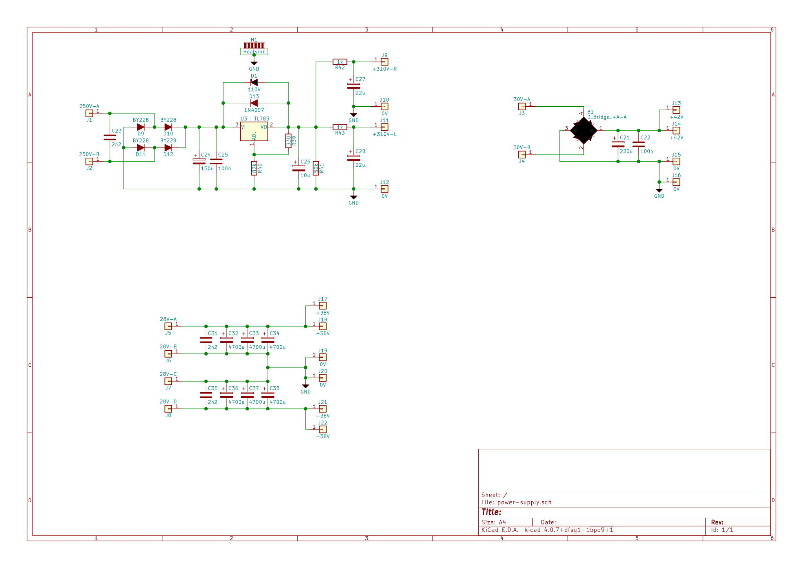
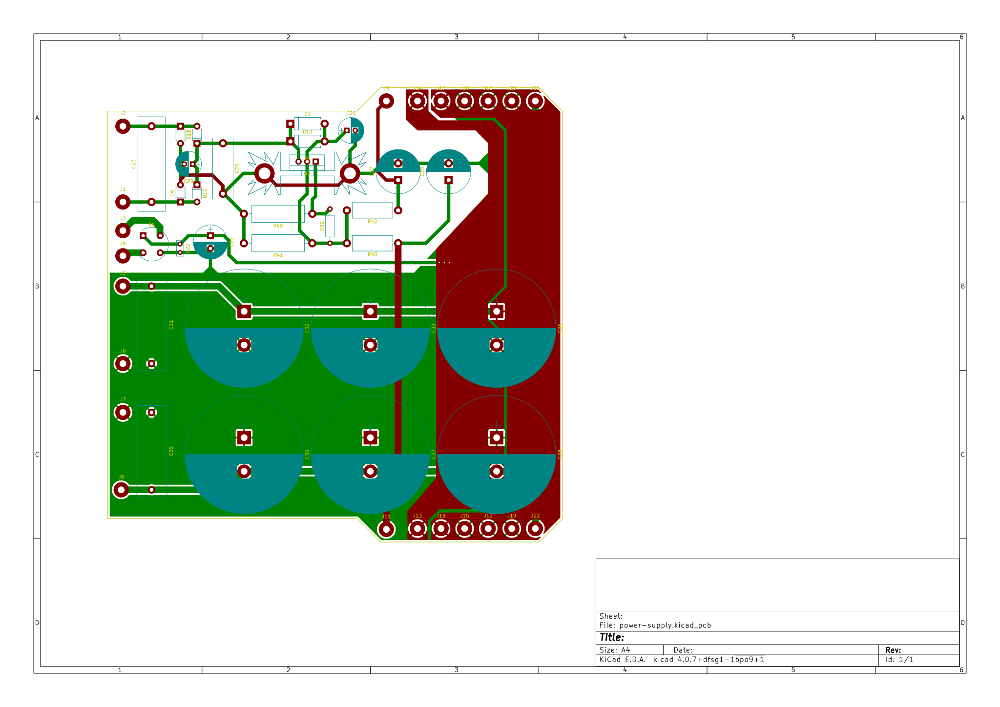
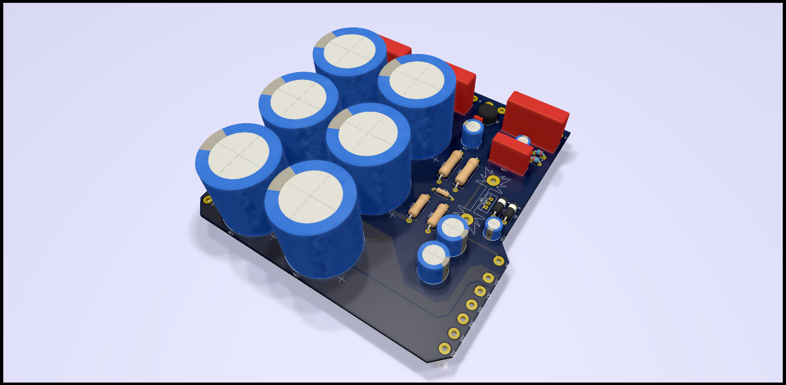
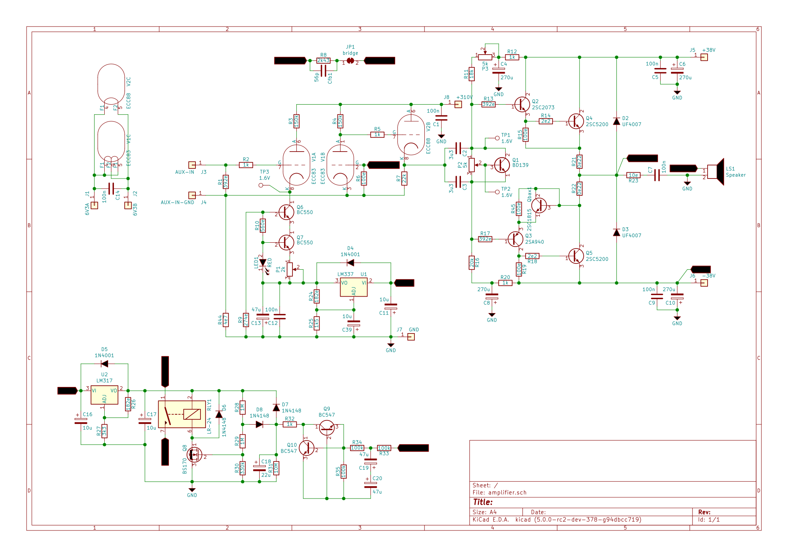
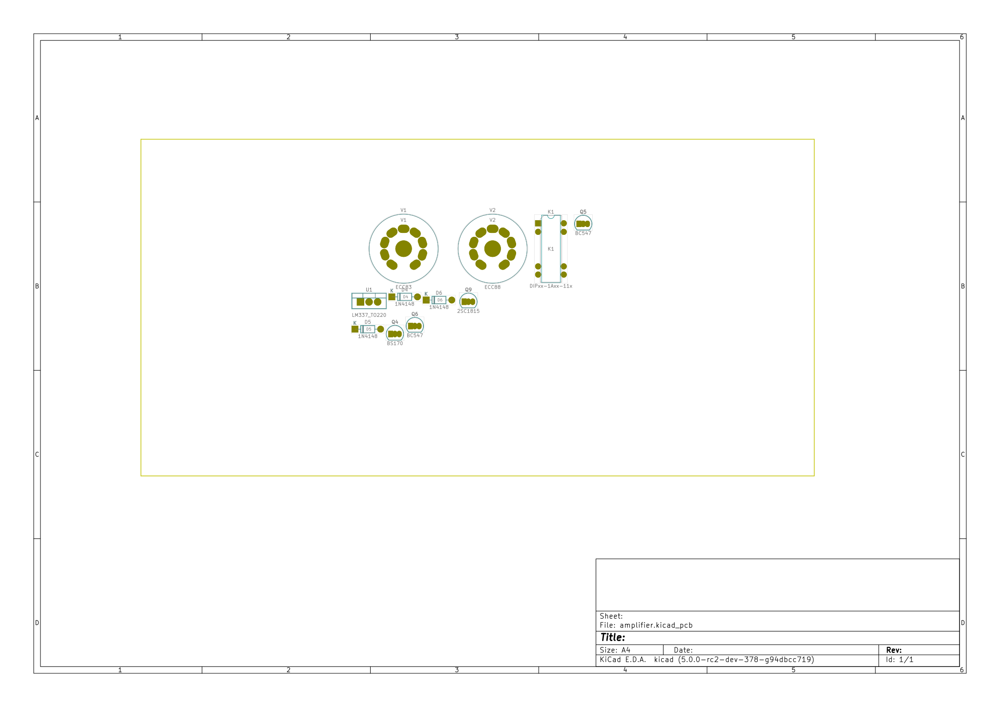
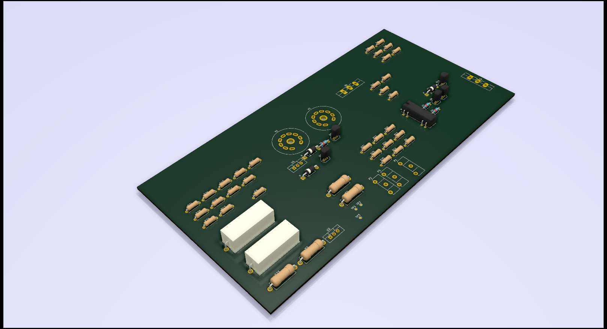

# Mugen, my implementation

This project is born because I wanted to connect an external amplifier to my Samsung smart tv that fits my tv cabinet.
The obvious step was to build a hybrid tube/transistor amplifier myself. I was pointed to the Mugen hybrid amplifier. It fit my size and power requirements (I have 2 60W Visaton speakers). Altough there were some things that need to be added for it to work with my setup. 

For one i want to use my tv remote to change the volume, so I will need to implement a IR reciever that controls a variable resistor in the input signal. This means an additional power supply, a microcontroller to process the IR signals and control a digital potentiometer. 

The next challenge is that my TV only has an optical audio out, so I need to hook up a optical to aux convertor. My plan as of now is to buy the smallest I can find and build it into the amplifier. If this proves impossible, it will stay as an external box. 

Finally I want the amplifier to look good. So I am planning to change the design to have both tubes above eachother when facing the front of the amplifier. I can then place a see through window in front of the Tubes so they can be seen. Then hookup some LEDs to the microcontroller, and place them behind the tubes for some cool effects. Using the Microcontroller I can the dim the LEDs using a PWM signal. This all being carefull not to let the PWM signal interfere with the audio signal.

## Todo

- [ ] Power Supply
   - [x] original schematic
   - [x] PCB
   - [ ] Add microcontoller power supply
- [ ] Amplifier
   - [ ] schematic
   - [ ] PCB
- [ ] Case
   - [ ] Front
      - [ ] design
      - [ ] build
   - [ ] back
      - [ ] design
      - [ ] build
   - [ ] bottom/top
   - [ ] sides
 - [ ] Firmware
    - [ ] IR reciever
    - [ ] Volume controll
    - [ ] LED PWM
    - [ ] LED Level Controll

## KiCad

The PCBs are designed using [KiCad](http://kicad-pcb.org/). This is the most usable free PCB design software I could find, that also works on Linux. Before this project I normally would use [Eagle](https://www.autodesk.com/products/eagle/overview), I even started this project using Eagle. But for me it is just to expensive for boards larger than `160mm x 100mm` ($65/month or in my case €85/month). So I chose a free alternative, that so far I am liking very much!

## Power Supply

### Schematic & PCB

### 3D View

## Amplifier

### Schematic & PCB

### 3D View

